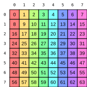
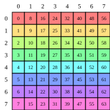
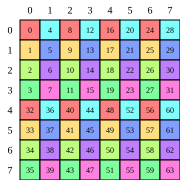
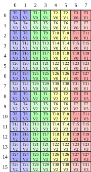
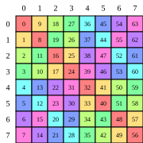
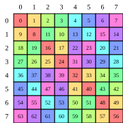

# PyCuTe

**A pure-Python reference implementation of CuTe — the hierarchical
layout-and-tensor algebra at the heart of
[CUTLASS 3.x](https://github.com/NVIDIA/cutlass) and the
[CuTe DSL](https://docs.nvidia.com/cutlass/latest/media/docs/pythonDSL/overview.html).
No GPU required.**

[](https://www.python.org/)
[](LICENSE.txt)
[](https://arxiv.org/abs/2603.02298)

Where C++ CuTe is a header-only template library tightly coupled to CUDA,
PyCuTe is plain Python you can `import` from any script — making it the place to
**learn** the algebra, **prototype** new transformations, and **generate test
vectors** for the C++ and DSL implementations.

It implements the layout algebra from the CuTe Whitepaper — `coalesce`,
`composition`, `complement`, `logical_divide`, `logical_product`,
`right_inverse`, `left_inverse`, `nullspace`, `recast`, `layout_add`, and
`greatest_common_domain` — over integer and coordinate (`ArithTuple`/basis)
strides, plus limited support for `F2` (XOR-swizzle) strides. A thin
`Tensor`/`Accessor` layer provides a reference data model.

> Cris Cecka, *CuTe Layout Representation and Algebra*,
> [arXiv:2603.02298](https://arxiv.org/abs/2603.02298). The Whitepaper is the
> authoritative source for every definition and post-condition; PyCuTe defers to
> it throughout.

## Installation

PyCuTe is installed in-place from a source checkout. Because many systems mark
the system Python as externally managed (PEP 668), the recommended path is a
virtual environment:

```sh
python3 -m venv .venv
source .venv/bin/activate

pip install -e .              # core layout algebra only (no third-party deps)
pip install -e ".[viz]"       # + visualization helpers (svgwrite, tabulate)
pip install -e ".[test]"      # + everything needed to run the test suite
```

**Python 3.10+** is the only hard requirement, and the core algebra has no
third-party dependencies. The optional extras add `svgwrite`/`tabulate`
(`viz`), `sympy` (`symbolic`), and `pytest` (`test`); the `draw_latex` helpers
need only a LaTeX install (e.g. TeX Live's `pdflatex`) for their PDF step. You
can also use the package straight from a repository checkout without installing
— `import pycute` works as long as the repo is on `PYTHONPATH`.

## Quick Start

```python
>>> from pycute import *

>>> A = Layout((3, 4), (4, 1))   # 3x4 row-major matrix
>>> A(2, 3)                      # call the layout on a coordinate
11
>>> A(11)                        # a 1-D coordinate works too
11
>>> size(A), rank(A)
(12, 2)

>>> coalesce(Layout((2, (1, 6)), (1, (6, 2))))
Layout(12, 1)
>>> composition(Layout(12), Layout((4, 3)))
Layout((4, 3), (1, 4))
>>> logical_divide(Layout(24), Layout(4, 2))
Layout((4, (2, 3)), (2, (1, 8)))
```

Build a `Tensor` and read/write data:

```python
>>> T = make_tensor(Layout((4, 4), (4, 1)))   # 4x4 row-major
>>> T[1, 2] = 42.0
>>> T[1, 2]
42.0
```

Print or draw a layout (see [Visualization](#visualization)):

```python
>>> from pycute.util import print_tensor, draw_svg
>>> print_tensor(Layout((4, 8), (1, 4)))
(4, 8):(1, 4)
0     4     8     12    16    20    24    28
1     5     9     13    17    21    25    29
2     6     10    14    18    22    26    30
3     7     11    15    19    23    27    31
>>> draw_svg(Layout((4, 8), (1, 4)))
Saved as layout.svg
```

## Core Concepts

The whole of CuTe fits in one sentence:

> A **`Layout`** is a function from coordinates to offsets, defined by a
> **`Shape`** (the coordinate(s) domain) and a 
> **`Stride`** (how coordinates become offsets)
> of the same hierarchical profile.

The stride is what turns a shape into a row-major, column-major, or arbitrarily
nested map:

| Layout | Description |
|---|---|
| `Layout((4, 8), (8, 1))` | 4×8 **row-major** |
| `Layout((4, 8), (1, 4))` | 4×8 **column-major** |
| `Layout(((2, 4), 8), ((1, 16), 2))` | **hierarchical** (nested modes) |

A small algebra combines layouts to express tiling, partitioning,
vectorization, and layout analysis. Every operation is a pure function that
takes layouts and returns another `Layout`:

- **`coalesce(A)`** — simplify to the fewest modes with the same map.
- **`composition(A, B)`** — functional composition; index `A` through `B`.
- **`complement(A)`** — the "missing" modes that fill out `A`'s codomain.
- **`logical_divide(A, T)`** — factor `A` into tiles of shape `T` (tiling).
- **`logical_product(A, B)`** — replicate `A`'s pattern across `B` (repetition).
- **`right_inverse` / `left_inverse` / `nullspace`** — invert and analyze maps.

A **`Tensor`** is a `Layout` paired with an **`Accessor`** (e.g. a pointer):
evaluating it at a coordinate evaluates the layout to an offset and dereferences
the accessor at that offset. That short story is the whole of CuTe — everything else is a
refinement or application of it. For the careful treatment of each piece, read
the [documentation](#documentation).

## Documentation

Start with [`docs/index.md`](docs/index.md). The documentation builds up from
hierarchical tuples to layouts to the full algebra, with runnable examples drawn
from the unit tests:

| File | Topic |
|---|---|
| [`docs/00_quickstart.md`](docs/00_quickstart.md) | Install and a first tour |
| [`docs/01_htuple.md`](docs/01_htuple.md) | Hierarchical tuples and the toolbox over them |
| [`docs/02_shape_stride.md`](docs/02_shape_stride.md) | `Shape`, `Stride`, and the integer-modules strides live in |
| [`docs/03_layout.md`](docs/03_layout.md) | `Layout`: construction, evaluation, coordinates, slicing |
| [`docs/04_layout_algebra.md`](docs/04_layout_algebra.md) | The layout algebra |
| [`docs/05_tensor.md`](docs/05_tensor.md) | `Tensor` and `Accessor` |
| [`docs/06_swizzle.md`](docs/06_swizzle.md) | `Swizzle` and `F2`-stride layouts |
| [`docs/07_visualization.md`](docs/07_visualization.md) | `print_tensor`, `draw_svg`, `draw_latex`, and color functors |
| [`docs/08_api_reference.md`](docs/08_api_reference.md) | Index of every function, class, and unit test |

## Visualization

PyCuTe renders layouts as ASCII tables (`print_tensor`, `print_table`), colored
SVGs (`draw_svg`, `draw_svg_tv`), or TikZ/PDF (`draw_latex`, `draw_latex_tv` —
the analogue of `cute::print_latex`). Every figure below is a plain PyCuTe
`Layout` drawn with `pycute.util`; regenerate them all with
[`examples/readme_figures.py`](examples/readme_figures.py):

```sh
python -m examples.readme_figures   # writes docs/images/*.svg  (needs the viz extra)
```

**A layout is a shape plus a stride.** The same 8×8 shape with two different
strides gives a row-major or a column-major map; each cell is labeled with its
offset and colored by `offset % 8`:

<table><tr>
<td align="center"><br><sub><code>Layout((8,8),(8,1))</code><br>Row-major</sub></td>
<td align="center"><br><sub><code>Layout((8,8),(1,8))</code><br>Column-major</sub></td>
<td align="center"><br><sub><code>Layout(((4,2), (2,4)), ((1,32), (4,8)))</code><br>Blocked</sub></td>
</tr></table>

**Thread-value layouts.** `draw_svg_tv` shows how a warp's `(thread, value)`
pairs tile a matrix — here the C-accumulator of an SM80 `16×8` MMA, colored by
thread. This is precisely the partitioning the layout algebra produces:

<p align="center">
<br>
<sub><code>Layout(((4,8),(2,2)), ((32,1),(16,8)))</code><br>(tid, vid) → (m, n) in a 16×8 tile</sub>
</p>

**Swizzles are just `F2` strides.** Coloring a shared-memory tile by bank
(`bank_color_8x`) makes conflicts visible. A row-major tile stores every column
in a single bank (vertical stripes → 8-way conflict); swapping the integer
strides for `F2` (XOR) strides permutes each row so that every column spans all
8 banks — conflict-free — with no special-casing in the algebra:

<table><tr>
<td align="center"><br><sub><code>Layout((8,8),(F2(1),F2(9)))</code><br>Swizzled Column-major</sub></td>
<td align="center"><br><sub><code>Layout((8,8),(F2(9),F2(1)))</code><br>Swizzled Row-major</sub></td>
</tr></table>

See [`docs/07_visualization.md`](docs/07_visualization.md) for every drawer, the
`(r, g, b)` color-functor catalog (`index_grey_8x`, `bank_color_32x`,
`thread_color_8x`, …), and the LaTeX/PDF output.

## Repository layout

```
pycute/
├── docs/       # documentation (start at docs/index.md); figures in docs/images/
├── examples/   # standalone scripts (einsum, TV-layout, README figures)
├── test/       # pytest unit tests (one test_*.py per operation)
└── pycute/     # the importable package
    └── util/   # optional printing and visualization helpers
```

## Running the tests

The suite uses [pytest](https://docs.pytest.org). Install the `test` extra
(see [Installation](#installation)) and run it from the repository root:

```sh
pytest                                # the whole suite, quiet
pytest --log-cli-level DEBUG          # with live logging
pytest test/test_coalesce.py          # a single module
pytest -k coalesce                    # tests matching a keyword
```

## References

- Cris Cecka. *CuTe Layout Representation and Algebra.*
  [arXiv:2603.02298](https://arxiv.org/abs/2603.02298)

- Jack Carlisle, Jay Shah, Reuben Stern, Paul VanKoughnett.
  *Categorical Foundations for CuTe Layouts.*
  [arXiv:2601.05972](https://arxiv.org/abs/2601.05972)

- Yang Shi, U. N. Niranjan, Animashree Anandkumar, Cris Cecka.
  *Tensor Contractions with Extended BLAS Kernels on CPU and GPU.*
  [HiPC 2016, pp. 193–202](https://ieeexplore.ieee.org/document/7839684)

- Bastian Hagedorn, Bin Fan, Hanfeng Chen, Cris Cecka, Michael Garland, Vinod Grover.
  *Graphene: An IR for Optimized Tensor Computations on GPUs.*
  [ASPLOS 2023, pp. 302–313](https://dl.acm.org/doi/10.1145/3582016.3582018)

- [NVIDIA CUTLASS / CuTe (C++)](https://github.com/NVIDIA/cutlass) — the original C++ implementation.

- [CuTe C++ documentation](https://docs.nvidia.com/cutlass/latest/media/docs/cpp/cute/00_quickstart.html)

- [NVIDIA CuTe DSL](https://docs.nvidia.com/cutlass/latest/media/docs/pythonDSL/overview.html) — the Python DSL that JIT-compiles CuTe kernels.

- [CuTe DSL documentation](https://docs.nvidia.com/cutlass/latest/media/docs/pythonDSL/cute_dsl_general/dsl_introduction.html)

## License

Copyright (c) 2026 NVIDIA CORPORATION & AFFILIATES. All rights reserved.
SPDX-License-Identifier: Apache-2.0
